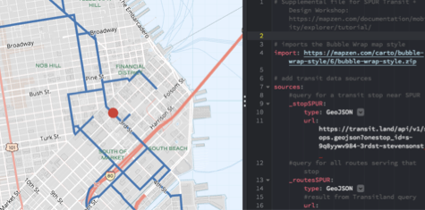
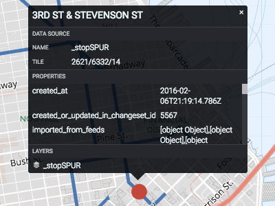

# Make your own transit map with Tangram Play

Maps of transit routes exist for San Francisco, but these show the entire transit system. What if you are only interested in the bus stops and routes near SPUR? You can make your own map by choosing the data you want to show.

In this exercise, you will be introduced to how you could make your own transit map with Tangram Play, which is an interactive text editor for making maps.

All you need is a browser and an internet connection while you are working. No special knowledge of coding or transit data is needed.

## Make a custom transit map

You will open a map in Tangram Play with route lines and a transit stop near SPUR. With Tangram Play, you can write and edit map styles and preview the changes live in the web browser. Tangram Play has two main interface components: the map preview and the editing pane. The map preview will show any changes made by writing in the editing pane on the fly.

1. Open http://bit.ly/2rXrqfx in a new browser tab. This is a shortened link to a Tangram Play map, which opens to display a basemap with several transit-related layers.

  

2. Click `Inspect` on the toolbar at the top to enable a mode where you can get attributes about the features you click.

  

3. Hover over features on the map, and click the point line to see details about it in a pop-up. If you scroll through the list, you see the properties from the Transitland entity.

  

4. Click `Inspect` again to turn off this mode.

## Modify the transit route and stop map symbols

This map has already been created for you, but you can do a few simple style changes to update how to display those features on the map. You can choose your own colors, or even draw them with the route colors from the data in Transitland, which originates from the GTFS file. You can also use special JavaScript functions that enables advanced drawing capabilities.

Tangram uses a human-readable format called `.yaml` to organize all the styling elements needed to draw a map. This file specifies the source of the data, which layers from that source to display on the map, and rules about how to draw those layers, such as color and line thickness.

Under `sources`, notice that the data sources are from URLs that request GeoJSON from the Transitland API. You can use Mobility Explorer to build the queries, and then copy the URL to use as the data source in Tangram Play.

Under `layers`, notice that there are style rules specified for the data. If you want to know more about how to draw the styles, see the [Tangram documentation](https://mapzen.com/documentation/tangram/draw/).

_Tip: The underscore in front of `_stopsSPUR` and `_routesSPUR` is a Tangram best practice to indicate that the name is a user-generated variable, compared to syntax required by Tangram._

1. Under `layers`, in the `stopsSPUR` block, click the square to change the `color`. You can use the color picker, or use any of the other [ways of specifying a color](https://mapzen.com/documentation/tangram/draw/#color) to modify it.

  

2. For the `size`, type a new value, in pixels, to change the size of the point on the map.
3. Under `layers`, in the `routesSPUR` block, change the `color` and `width` using the same method.
4. When you are done, click `Save` to download the YAML file so you can re-create your map in the future. You can also sign in to your Mapzen account (after [creating one](https://mapzen.com/documentation/overview/), if needed) and save the map to your Mapzen account.

## Exercise summary and next steps

In this exercise, you experimented with the map styles using Tangram Play to customize your transit map.

While the data layers were already added and styled for you, you now have an introduction to how you could make a map showing the routes and stops that are important to you.
