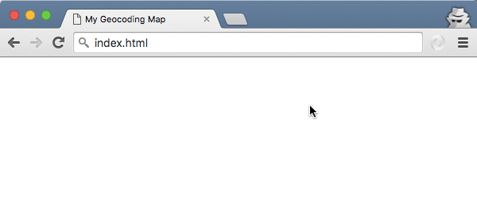

# Add the Mapzen Search geocoder to a map

[Mapzen Search](https://mapzen.com/projects/search) is a modern, geographic search service based entirely on open-source tools and open data. Use this functionality to enhance any app that has a geographic context, such as ones that help in delivering goods, locating hotels or venues, or providing local weather forecasts.

Through a process known as [geocoding](https://en.wikipedia.org/wiki/Geocoding), Mapzen Search allows you to enter an address or the name of a landmark or business, and the service translates the result into geographic coordinates for mapping. Mapzen Search is built on [Pelias](https://github.com/pelias), an open-source geocoding project.

In this walkthrough, you will learn how to make a map with a search box that allows you to enter addresses and place names and locate them on a map. To complete the tutorial, you should have some familiarity with HTML and JavaScript, although all the source code is provided. You also need a Mapzen Search [API key](https://mapzen.com/developers), which requires a [GitHub account](https://help.github.com/articles/signing-up-for-a-new-github-account/) for authorization. You can use any text editor and operating system, but must keep an Internet connection while you are working.

## Create an index page

You are ready to start building your map. You will need to use a text editor to update the HTML.

Suggested text editor applications include [Atom - OS X, Windows, Linux](https://atom.io/); [Notepad++ - Windows](https://notepad-plus-plus.org/); [TextWrangler - OS X](http://www.barebones.com/products/textwrangler/); and  [Sublime - OS X, Windows, Linux; free trial](http://www.sublimetext.com/). While you can use the apps installed with your operating system, such as Notepad or TextEdit, they do not provide the helpful indentations, code coloring and autocomplete, or text alignment options found in the other editors. For TextEdit, you must go to the Format menu and click Make Plain Text to use the plain-text version of the file. Do not use an app that applies rich formatting, such as Word or Wordpad.

The end of this walkthrough has a finished version of the HTML that you can use to check your work or review if you need to troubleshoot an error.

1. Start your text editor with a blank document and copy and paste the following HTML. (Note: If the text editor you are using requires you to name and save a document at the time when it is first created, call the file `index.html`.)

    ```html
    <!DOCTYPE html>
    <html>
    <head>
    </head>
    <body>
    </body>
    </html>
    ```

    These form the basic structure of an HTML document. `<!DOCTYPE html>` goes at the top of every HTML page and indicates that it is written for HTML5, and the `<html>` tags tell your browser that the content is HTML. The `<head>` tag contains the title for the page and other metadata about the page, while the `<body>` is where you add the code and the rest of the content on your page. There are many [web tutorials](http://www.w3schools.com/html/default.asp) available to help you experiment with and learn more about HTML documents and the tags in them.

2. In the `<head>` tag, add a title, such as `<title>My Geocoding Map</title>`.
3. On the next line, add a metadata tag so you can properly display diacritics and characters from different languages.

    ```html
    <meta charset="utf-8">
    ```

4. Name your the document `index.html` (where the file name is `index` and the type is `.html`) and save it.
5. Drag your index.html file onto a web browser tab. It should show your title, `My Geocoding Map`, but the web page canvas will be blank.

    

Your HTML should look like this:

```html
<!DOCTYPE html>
<html>
<head>
  <title>My Geocoding Map</title>
  <meta charset="utf-8">
</head>
<body>
</body>
</html>
```

## Add references to CSS and JavaScript files

The Leaflet JavaScript library provides tools for building an interactive map for web and mobile devices. Leaflet is extensible, and developers have built additional tools for Leaflet maps.

Mapzen has packaged Leaflet into a library called Mapzen.js. It contains all the Leaflet functionality, as well as additional tools for working with Mapzen maps and search. Mapzen.js simplifies the process of using Mapzen's maps within Leaflet.

A cascading style sheet (CSS) is used to style a webpage, including layout and fonts, and JavaScript adds functionality to the page. In your `index.html` file, you need to list the CSS and JavaScript files.

1. In `index.html`, at the bottom of the `<head>` section, add references to the Mapzen.js CSS and JavaScript files. You are linking to these from a remote website, rather than from a file on your machine.

    ```html
    <link rel="stylesheet" href="https://mapzen.com/js/mapzen.css">
    <script src="https://mapzen.com/js/mapzen.min.js"></script>
    ```

2. Save your edits and refresh the browser. The webpage should still appear empty because you have not added any code to interact with these references.

After adding these, your index.html file should look something like this.

```html
<!DOCTYPE html>
<html>
  <head>
  <title>My Geocoding Map</title>
  <meta charset="utf-8">
    <link rel="stylesheet" href="https://mapzen.com/js/mapzen.css">
    <script src="https://mapzen.com/js/mapzen.min.js"></script>
</head>
<body>
</body>
</html>
```

Note that you are linking to a website that is serving the Mapzen.js CSS and JavaScript, but you can also [view, download, and contribute to the source code](https://github.com/mapzen/mapzen.js) if you want to access the contents of the library.

## Add a map to the page

To display a Leaflet map on a page, you need a `<div>` element, which is a container on the page that groups elements, with an ID value. If you want to know more about initializing a Leaflet map, see the [Leaflet getting started documentation](http://leafletjs.com/examples/quick-start.html).

1. At the bottom of the `<head>` section, after the references you added in the earlier steps, add a `<style>` tag and the following attributes to set the size of the map on your webpage.

    ```html
    <style>
      #map {
        height: 100%;
        width: 100%;
        position: absolute;
      }
      html,body{margin: 0; padding: 0}
    </style>
    ```

2. At the top of the `<body>` section, add the `<div>`.

    ```html
    <div id="map"></div>
    ```

3. Directly after the `<div>`, add this JavaScript code within a `<script>` tag to initialize a map.

    ```html
    <script>
      var map = L.Mapzen.map('map', {
        center: [47.61033,-122.31801],
        zoom: 16,
        scene: L.Mapzen.HouseStyles.BubbleWrap
      });
    </script>
    ```

    `L.xxxxx` is a convention used with the Leaflet API. The `center: [47.61033,-122.31801]` parameter sets the center point of the map, in decimal degrees, at the location of this building at Seattle University. The next line sets the zoom level, which is like a map scale or resolution, where a smaller value shows a larger area in less detail, and a larger zoom level value depicts smaller area in great detail.

    The `scene: L.Mapzen.HouseStyles.BubbleWrap` line sets the style used for the map. In this case, it is Mapzen's all-purpose stylesheet called BubbleWrap.

4. Save your edits and refresh the browser.

Your index.html should look something like this:

```html
<!DOCTYPE html>
<html lang="en">
  <head>
    <meta charset="utf-8"/>
    <meta name="viewport" content="width=device-width, initial-scale=1"/>
    <link rel="stylesheet" href="https://mapzen.com/js/mapzen.css">
    <script src="https://mapzen.com/js/mapzen.min.js"></script>

    <style>
      #map {
        height: 100%;
        width: 100%;
        position: absolute;
      }
    html,body{margin: 0; padding: 0}
  </style>

  </head>
  <body>
    <div id="map"></div>
    <script>
      // Add a map to the #map div
      // Center on the Pigott building at Seattle University:
      var map = L.Mapzen.map('map', {
        center: [47.61033,-122.31801],
        zoom: 16,
        scene: L.Mapzen.HouseStyles.BubbleWrap
      });
    </script>
  </body>
</html>
```

At this point, you have a map! You should see a map, zoom controls, and attribution in the bottom corner.


## Add the Search box

So far, you have referenced the necessary files, initialized Leaflet with a map container on the page, and added data to the map. Now, you are ready to add the Search box.

2. Inside the same `<script>` tag, initialize a search box and add it to the map with the following code.

    ```js
    var geocoder = L.Mapzen.geocoder('search-q78U1e7');
    geocoder.addTo(map);
    ```

    You are passing one parameter to the search, which is the [API key](https://en.wikipedia.org/wiki/Application_programming_interface_key) inside the single quotes. For this workshop, you are being provided with an API key. Because the search service is shared among many users, an API key is a way to make sure that the performance is acceptable for everyone.

3. Save your edits and refresh the browser. You should see search box in the left corner, near the zoom controls.

    

Your `<body>` section should look like this:

```html
[...]
<script>
  // Add a map to the #map div
  // Center on the Pigott building at Seattle University:
  var map = L.Mapzen.map('map', {
    center: [47.61033,-122.31801],
    zoom: 16,
    scene: L.Mapzen.HouseStyles.BubbleWrap
  });

  // Add the Search box to the map
  var geocoder = L.Mapzen.geocoder('search-q78U1e7');
  geocoder.addTo(map);
</script>
</body>
[...]
```

## Search for places on the map

1. On the map, type `Seattle University` in the Search box. As you type, the text automatically completes to suggest matching results.
2. In the results list, find the entry for `Seattle University` and click it to zoom and add a point to the map at that location. (The point is only on your map, and does not update OpenStreetMap.)

    
3. Search for other addresses or points of interest.

## Customize the geocoder

Mapzen.js provides options for customizing the way you interact with the map, and the Mapzen Search is also very flexible. Now that you have a map on your page with a Search box, you can add more features to it. You need to modify the line defining the geocoder to include additional parameters.

1. Modify the geocoder so you can pass in other parameters. Make sure the () and {} close properly.

```js
  var geocoder = L.Mapzen.geocoder('search-q78U1e7', {
  });
  geocoder.addTo(map);
```

2. Add the `autocomplete: false` following parameter to specify whether the Search box should autocomplete as you type. Autocomplete is enabled by default, so adding this means that you will turn it off.

```js
  var geocoder = L.Mapzen.geocoder('search-q78U1e7', {
    autocomplete: false
  });
  geocoder.addTo(map);
```
3. Save your edits and refresh the browser. Type `901 12th Avenue` in the Search box and press Enter. Notice now that the results are not found until you press the Enter key.

The Mapzen Search API has multiple endpoints that you can use for querying. Previously, you were using the `autocomplete` endpoint, but now you are using `search`. You can find a listing of all the endpoints and parameters in the Mapzen Search documentation.

If you look at your browser's developer tools, you can see the query URL change from `https://search.mapzen.com/v1/autocomplete?text=` to `https://search.mapzen.com/v1/search?text=`.

4. Change the value of `autocomplete` to `true` so the matching results will again appear as you type.

## Prioritize results around a location

Mapzen Search allows you to provide a location where to priortize the results. This is known as a focus. You can also search within a circle with a specific radius to narrow your results. There are also options for customizing the parameters for the Mapzen Search service, such as limiting the search to the map's extent or prioritizing results near the current view. Right now, you may notice that results from around the world appear in the list.

Because Mapzen.js includes the functionality available with Leaflet, you can use the Leaflet `getCenter()` method to return the geographical center of your map view. The code returns an `LatLng` object with an array containing the latitude and longitude values in decimal degrees.

1. On the line above the `var geocoder = L.Mapzen.geocoder('search-q78U1e7', {`, add the following code to declare a variable to hold the coordinates at the center of the map.

```js
  var focusPoint = map.getCenter('map');
  var geocoder = L.Mapzen.geocoder('search-q78U1e7', {
```

2. Add these parameters to set the focus point and a circle in which to search. The radius is set in kilometers. Be sure to add a `,` after the `autocomplete: true` line.

```js
var focusPoint = map.getCenter('map');
var geocoder = L.Mapzen.geocoder('search-q78U1e7', {
  autocomplete: true,
  params: {
       focus: focusPoint,
       'boundary.circle.lat': focusPoint.lat,
       'boundary.circle.lon': focusPoint.lng,
       'boundary.circle.radius': 5
   	}
});
geocoder.addTo(map);
```

The code you added in this section should look something like this.

```js
var focusPoint = map.getCenter('map');
var geocoder = L.Mapzen.geocoder('search-q78U1e7', {
  autocomplete: true,
  params: {
       focus: focusPoint,
       'boundary.circle.lat': focusPoint.lat,
       'boundary.circle.lon': focusPoint.lng,
       'boundary.circle.radius': 5
    }
});
geocoder.addTo(map);
```

## Choose which data sources to search

Mapzen Search uses a [variety of open data sources](https://mapzen.com/documentation/search/data-sources/), including OpenStreetMap. Part of the power of open data is that anyone can change the source data and improve the quality for everyone. If you are unable to find a location, the place could be missing or incorrect in the source datasets.

You can choose which data sources to search by passing a parameter for the `sources`.

1. Add `sources: osm` to the list of params. Be sure to add a `comma` to the line above it.

```js
var geocoder = L.Mapzen.geocoder('search-q78U1e7', {
  autocomplete: true,
  params: {
       focus: focusPoint,
       'boundary.circle.lat': focusPoint.lat,
       'boundary.circle.lon': focusPoint.lng,
       'boundary.circle.radius': 5,
       sources: 'osm'
  }
});
geocoder.addTo(map);
```
2. Save your edits and refresh the browser.
3. Type `library` in the Search box and choose one of the results in the list.


## Walkthrough summary

In this walkthrough, you learned the basics of adding the Mapzen Search geocoding engine to a Leaflet map. If you want to learn more about Mapzen Search, review the [documentation](index.md).

Because the geocoder is still under development and considered experimental, if you are getting unexpected search results, please add an issue to the [Pelias GitHub repository](https://github.com/pelias/pelias/issues). The developers can investigate and decide if the problem is caused by software or data, and work to fix it either way.

In this workshop, you were provided with an API key. To use Mapzen Search in the future, sign up for your own  [API key](https://en.wikipedia.org/wiki/Application_programming_interface_key). Because the search service is shared among many users, an API key is a way to make sure that the performance is acceptable for everyone. Sign in at https://mapzen.com/developers to create and manage your API keys.

## Completed HTML for this walkthrough

You can refer to this HTML if you want to review your work or troubleshoot an error. You will need to substitute your own API key for the placeholder text in the source code.

```html
<!DOCTYPE html>
<html lang="en">
  <head>
    <title>My Geocoding Map</title>
    <meta charset="utf-8">
      <link rel="stylesheet" href="https://mapzen.com/js/mapzen.css">
      <script src="https://mapzen.com/js/mapzen.min.js"></script>

    <style>
      #map {
        height: 100%;
        width: 100%;
        position: absolute;
      }
    html,body{margin: 0; padding: 0}
  </style>

  </head>
  <body>
    <div id="map"></div>
    <script>
      // Add a map to the #map div
      // Center on the Pigott building at Seattle University:
      var map = L.Mapzen.map('map', {
        center: [47.61033,-122.31801],
        zoom: 16,
        scene: L.Mapzen.HouseStyles.BubbleWrap
      });

      // Use the center of the map as the focusPoint (updates when panning)
      // getCenter returns a latLng object with properties of lat, lng
      var focusPoint = map.getCenter('map');

      // Add the Search box to the map
      var geocoder = L.Mapzen.geocoder('search-q78U1e7', {
        autocomplete: true,
        params: {
             focus: focusPoint,
        //     // Get the lat, lon from the focus point
             'boundary.circle.lat': focusPoint.lat,
             'boundary.circle.lon': focusPoint.lng,
        //     // Set a radius to search around the point, in km
             'boundary.circle.radius': 5,
        //     // Use only OpenStreetMap as the data source
              sources: 'osm'
         	}
      });
      geocoder.addTo(map);
    </script>
  </body>
</html>
```
